<h1 align="center">Happy Guest Travel - Android</h1>

### Module Graph

```mermaid
%%{
  init: {
    'theme': 'base',
    'themeVariables': {"primaryTextColor":"#E0E0E0","primaryColor":"#374151","primaryBorderColor":"#1F2937","tertiaryColor":"#111827","lineColor":"#10B981","fontSize":"14px"}
  }
}%%

graph LR
  subgraph :app
    :app:domain["domain"]
    :app:data["data"]
  end
  subgraph :core
    :core:common["common"]
    :core:designsystem["designsystem"]
    :core:common-ui["common-ui"]
    :core:resources["resources"]
    :core:navigation["navigation"]
    :core:network["network"]
    :core:firebase["firebase"]
    :core:datastore["datastore"]
    :core:connectivity["connectivity"]
    :core:api["api"]
    :core:timber["timber"]
    :core:signalrlib["signalrlib"]
  end
  subgraph :feature
    :feature:auth["auth"]
    :feature:home["home"]
  end
  subgraph :feature:auth
    :feature:auth:welcome["welcome"]
    :feature:auth:register["register"]
    :feature:auth:login["login"]
    :feature:auth:loginWithEmail["loginWithEmail"]
    :feature:auth:otp["otp"]
    :feature:auth:userInfo["userInfo"]
    :feature:auth:userName["userName"]
    :feature:auth:forgetPassword["forgetPassword"]
  end
  subgraph :feature:auth:forgetPassword
    :feature:auth:forgetPassword:data["data"]
    :feature:auth:forgetPassword:domain["domain"]
  end
  subgraph :feature:auth:login
    :feature:auth:login:data["data"]
    :feature:auth:login:domain["domain"]
  end
  subgraph :feature:auth:loginWithEmail
    :feature:auth:loginWithEmail:data["data"]
    :feature:auth:loginWithEmail:domain["domain"]
  end
  subgraph :feature:auth:otp
    :feature:auth:otp:data["data"]
    :feature:auth:otp:domain["domain"]
  end
  subgraph :feature:auth:register
    :feature:auth:register:data["data"]
    :feature:auth:register:domain["domain"]
  end
  subgraph :feature:auth:userInfo
    :feature:auth:userInfo:data["data"]
    :feature:auth:userInfo:domain["domain"]
  end
  subgraph :feature:auth:userName
    :feature:auth:userName:data["data"]
    :feature:auth:userName:domain["domain"]
  end
  subgraph :feature:auth:welcome
    :feature:auth:welcome:data["data"]
    :feature:auth:welcome:domain["domain"]
  end
  subgraph :feature:home
    :feature:home:dashboard["dashboard"]
    :feature:home:search["search"]
    :feature:home:share["share"]
    :feature:home:chat["chat"]
    :feature:home:profile["profile"]
    :feature:home:customizeUserInfo["customizeUserInfo"]
    :feature:home:onboarding["onboarding"]
    :feature:home:userTeams["userTeams"]
    :feature:home:mediaViewer["mediaViewer"]
    :feature:home:camerax["camerax"]
  end
  subgraph :feature:home:camerax
    :feature:home:camerax:data["data"]
    :feature:home:camerax:domain["domain"]
  end
  subgraph :feature:home:chat
    :feature:home:chat:data["data"]
    :feature:home:chat:domain["domain"]
    :feature:home:chat:newChat["newChat"]
    :feature:home:chat:chatMessaging["chatMessaging"]
  end
  subgraph :feature:home:chat:chatMessaging
    :feature:home:chat:chatMessaging:data["data"]
    :feature:home:chat:chatMessaging:domain["domain"]
  end
  subgraph :feature:home:chat:newChat
    :feature:home:chat:newChat:data["data"]
    :feature:home:chat:newChat:domain["domain"]
    :feature:home:chat:newChat:newGroupChat["newGroupChat"]
  end
  subgraph :feature:home:chat:newChat:newGroupChat
    :feature:home:chat:newChat:newGroupChat:data["data"]
    :feature:home:chat:newChat:newGroupChat:domain["domain"]
  end
  subgraph :feature:home:customizeUserInfo
    :feature:home:customizeUserInfo:data["data"]
    :feature:home:customizeUserInfo:domain["domain"]
  end
  subgraph :feature:home:dashboard
    :feature:home:dashboard:data["data"]
    :feature:home:dashboard:domain["domain"]
  end
  subgraph :feature:home:mediaViewer
    :feature:home:mediaViewer:data["data"]
    :feature:home:mediaViewer:domain["domain"]
  end
  subgraph :feature:home:onboarding
    :feature:home:onboarding:data["data"]
    :feature:home:onboarding:domain["domain"]
  end
  subgraph :feature:home:profile
    :feature:home:profile:data["data"]
    :feature:home:profile:domain["domain"]
    :feature:home:profile:userRelation["userRelation"]
    :feature:home:profile:profileEdit["profileEdit"]
  end
  subgraph :feature:home:profile:profileEdit
    :feature:home:profile:profileEdit:data["data"]
    :feature:home:profile:profileEdit:domain["domain"]
    :feature:home:profile:profileEdit:selectBranch["selectBranch"]
  end
  subgraph :feature:home:profile:profileEdit:selectBranch
    :feature:home:profile:profileEdit:selectBranch:domain["domain"]
    :feature:home:profile:profileEdit:selectBranch:data["data"]
  end
  subgraph :feature:home:profile:userRelation
    :feature:home:profile:userRelation:data["data"]
    :feature:home:profile:userRelation:domain["domain"]
  end
  subgraph :feature:home:search
    :feature:home:search:data["data"]
    :feature:home:search:domain["domain"]
  end
  subgraph :feature:home:share
    :feature:home:share:data["data"]
    :feature:home:share:domain["domain"]
  end
  subgraph :feature:home:userTeams
    :feature:home:userTeams:data["data"]
    :feature:home:userTeams:domain["domain"]
  end
  :app:domain --> :domain
  :app:domain --> :core:common
  :app --> :konsist-test
  :app --> :data
  :app --> :domain
  :app --> :core:designsystem
  :app --> :core:common-ui
  :app --> :core:common
  :app --> :core:resources
  :app --> :core:navigation
  :app --> :core:network
  :app --> :core:firebase
  :app --> :core:datastore
  :app --> :core:connectivity
  :app --> :core:api
  :app --> :core:timber
  :app --> :core:signalrlib
  :app --> :app:data
  :app --> :app:domain
  :app --> :feature:auth
  :app --> :feature:auth:welcome
  :app --> :feature:auth:welcome:data
  :app --> :feature:auth:welcome:domain
  :app --> :feature:auth:register
  :app --> :feature:auth:register:data
  :app --> :feature:auth:register:domain
  :app --> :feature:auth:login
  :app --> :feature:auth:login:data
  :app --> :feature:auth:login:domain
  :app --> :feature:auth:loginWithEmail
  :app --> :feature:auth:loginWithEmail:data
  :app --> :feature:auth:loginWithEmail:domain
  :app --> :feature:auth:otp
  :app --> :feature:auth:otp:data
  :app --> :feature:auth:otp:domain
  :app --> :feature:auth:userInfo
  :app --> :feature:auth:userInfo:data
  :app --> :feature:auth:userInfo:domain
  :app --> :feature:auth:userName
  :app --> :feature:auth:userName:data
  :app --> :feature:auth:userName:domain
  :app --> :feature:auth:forgetPassword
  :app --> :feature:auth:forgetPassword:data
  :app --> :feature:auth:forgetPassword:domain
  :app --> :feature:home
  :app --> :feature:home:dashboard
  :app --> :feature:home:dashboard:data
  :app --> :feature:home:dashboard:domain
  :app --> :feature:home:search
  :app --> :feature:home:search:data
  :app --> :feature:home:search:domain
  :app --> :feature:home:share
  :app --> :feature:home:share:data
  :app --> :feature:home:share:domain
  :app --> :feature:home:chat
  :app --> :feature:home:chat:data
  :app --> :feature:home:chat:domain
  :app --> :feature:home:chat:newChat
  :app --> :feature:home:chat:newChat:data
  :app --> :feature:home:chat:newChat:domain
  :app --> :feature:home:chat:newChat:newGroupChat
  :app --> :feature:home:chat:newChat:newGroupChat:data
  :app --> :feature:home:chat:newChat:newGroupChat:domain
  :app --> :feature:home:chat:chatMessaging
  :app --> :feature:home:chat:chatMessaging:data
  :app --> :feature:home:chat:chatMessaging:domain
  :app --> :feature:home:profile
  :app --> :feature:home:profile:data
  :app --> :feature:home:profile:domain
  :app --> :feature:home:profile:userRelation
  :app --> :feature:home:profile:userRelation:data
  :app --> :feature:home:profile:userRelation:domain
  :app --> :feature:home:profile:profileEdit
  :app --> :feature:home:profile:profileEdit:data
  :app --> :feature:home:profile:profileEdit:domain
  :app --> :feature:home:profile:profileEdit:selectBranch
  :app --> :feature:home:profile:profileEdit:selectBranch:domain
  :app --> :feature:home:profile:profileEdit:selectBranch:data
  :app --> :feature:home:customizeUserInfo
  :app --> :feature:home:customizeUserInfo:data
  :app --> :feature:home:customizeUserInfo:domain
  :app --> :feature:home:onboarding
  :app --> :feature:home:onboarding:data
  :app --> :feature:home:onboarding:domain
  :app --> :feature:home:userTeams
  :app --> :feature:home:userTeams:data
  :app --> :feature:home:userTeams:domain
  :app --> :feature:home:mediaViewer
  :app --> :feature:home:mediaViewer:data
  :app --> :feature:home:mediaViewer:domain
  :app --> :feature:home:camerax
  :app --> :feature:home:camerax:data
  :app --> :feature:home:camerax:domain
  :app:data --> :domain
  :app:data --> :core:common
  :app:data --> :app:domain

classDef android-library fill:#EF4444,stroke:#fff,stroke-width:2px,color:#fff;
classDef android-application fill:#3B82F6,stroke:#fff,stroke-width:2px,color:#fff;
class :app:domain android-library
class :domain android-library
class :core:common android-library
class :app android-application
class :konsist-test android-library
class :data android-library
class :core:designsystem android-library
class :core:common-ui android-library
class :core:resources android-library
class :core:navigation android-library
class :core:network android-library
class :core:firebase android-library
class :core:datastore android-library
class :core:connectivity android-library
class :core:api android-library
class :core:timber android-library
class :core:signalrlib android-library
class :app:data android-library
class :feature:auth android-library
class :feature:auth:welcome android-library
class :feature:auth:welcome:data android-library
class :feature:auth:welcome:domain android-library
class :feature:auth:register android-library
class :feature:auth:register:data android-library
class :feature:auth:register:domain android-library
class :feature:auth:login android-library
class :feature:auth:login:data android-library
class :feature:auth:login:domain android-library
class :feature:auth:loginWithEmail android-library
class :feature:auth:loginWithEmail:data android-library
class :feature:auth:loginWithEmail:domain android-library
class :feature:auth:otp android-library
class :feature:auth:otp:data android-library
class :feature:auth:otp:domain android-library
class :feature:auth:userInfo android-library
class :feature:auth:userInfo:data android-library
class :feature:auth:userInfo:domain android-library
class :feature:auth:userName android-library
class :feature:auth:userName:data android-library
class :feature:auth:userName:domain android-library
class :feature:auth:forgetPassword android-library
class :feature:auth:forgetPassword:data android-library
class :feature:auth:forgetPassword:domain android-library
class :feature:home android-library
class :feature:home:dashboard android-library
class :feature:home:dashboard:data android-library
class :feature:home:dashboard:domain android-library
class :feature:home:search android-library
class :feature:home:search:data android-library
class :feature:home:search:domain android-library
class :feature:home:share android-library
class :feature:home:share:data android-library
class :feature:home:share:domain android-library
class :feature:home:chat android-library
class :feature:home:chat:data android-library
class :feature:home:chat:domain android-library
class :feature:home:chat:newChat android-library
class :feature:home:chat:newChat:data android-library
class :feature:home:chat:newChat:domain android-library
class :feature:home:chat:newChat:newGroupChat android-library
class :feature:home:chat:newChat:newGroupChat:data android-library
class :feature:home:chat:newChat:newGroupChat:domain android-library
class :feature:home:chat:chatMessaging android-library
class :feature:home:chat:chatMessaging:data android-library
class :feature:home:chat:chatMessaging:domain android-library
class :feature:home:profile android-library
class :feature:home:profile:data android-library
class :feature:home:profile:domain android-library
class :feature:home:profile:userRelation android-library
class :feature:home:profile:userRelation:data android-library
class :feature:home:profile:userRelation:domain android-library
class :feature:home:profile:profileEdit android-library
class :feature:home:profile:profileEdit:data android-library
class :feature:home:profile:profileEdit:domain android-library
class :feature:home:profile:profileEdit:selectBranch android-library
class :feature:home:profile:profileEdit:selectBranch:domain android-library
class :feature:home:profile:profileEdit:selectBranch:data android-library
class :feature:home:customizeUserInfo android-library
class :feature:home:customizeUserInfo:data android-library
class :feature:home:customizeUserInfo:domain android-library
class :feature:home:onboarding android-library
class :feature:home:onboarding:data android-library
class :feature:home:onboarding:domain android-library
class :feature:home:userTeams android-library
class :feature:home:userTeams:data android-library
class :feature:home:userTeams:domain android-library
class :feature:home:mediaViewer android-library
class :feature:home:mediaViewer:data android-library
class :feature:home:mediaViewer:domain android-library
class :feature:home:camerax android-library
class :feature:home:camerax:data android-library
class :feature:home:camerax:domain android-library

classDef focus fill:#3B82F6,stroke:#fff,stroke-width:2px,color:#fff;
class :app:domain focus
class :app focus
class :app:data focus
```


## Find this repository useful? :heart:
Support it by joining __[stargazers](https://github.com/iamkurtgoz/HappyGuestTravelAndroid)__ for this repository. :star: <br>
Also, __[follow me](https://github.com/iamkurtgoz)__ on GitHub for my next creations! 🤩

# License
```xml
    Copyright 2024 HappyGuestTravelAndroid

    Licensed under the Apache License, Version 2.0 (the "License");
    you may not use this file except in compliance with the License.
    You may obtain a copy of the License at

    http://www.apache.org/licenses/LICENSE-2.0

    Unless required by applicable law or agreed to in writing, software
    distributed under the License is distributed on an "AS IS" BASIS,
    WITHOUT WARRANTIES OR CONDITIONS OF ANY KIND, either express or implied.
    See the License for the specific language governing permissions and
    limitations under the License.
```